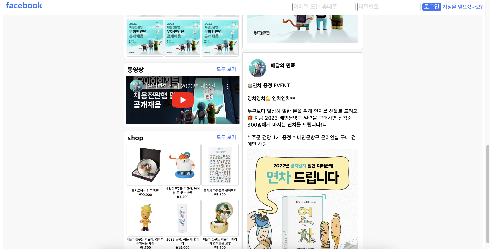

# facebook page 설명

우선 <html> 태그에 대한 전체적인 width, height, font-famliy를 설정하고 각 요소에서 오버라이딩


## 사진 동그랗게 만들기

```html
<div class="card-title">
    <div class="card-div">
        
    </div>
    <div class="card-name">배달의 민족</div>
</div>
```

```css
.card-title {
    width: 100%;
    display: inline-flex;
}

.card-div {
    width: 15%;
    margin: 10px;
    border-radius: 70%;
    overflow: hidden;
    justify-content: flex-start;
}
```

## div 그라데이션 설정

```css
/* 배경 그라데이션, %로 비율 지정 */
background: linear-gradient(#98e9ff, #ffffff 40%);
```

## 메뉴 목록에 마우스 올릴때 효과 및 ‘홈’만 선택되어있는 채로 만들어두기

```css
.list>*:hover{
    color: #3875f8;
    border-bottom: solid #3875f8 2px;
}

#selected{
    color: #3875f8;
    border-bottom: solid #3875f8 2px;
}
```

---



## 상단바 고정

```css
Position: sticky; 
top:0px;
```

## 동영상 유튜브에서 가져오기

```html
<div>
    <iframe src="https://www.youtube.com/embed/UeiXoz89XuM" frameborder="0" width="100%"></iframe>
</div>
```

## 사진 배치 - 표

```html
<table>
    <tr>
        <td class="td-img"></td>
        <td class="td-img"></td>
        <td class="td-img"></td>
    </tr>
    <tr>
        <td class="td-img"></td>
        <td class="td-img"></td>
        <td class="td-img"></td>
    </tr>
</table>
```

```css
td {
    font-size: 0.5rem;
    text-align: center;
}

.td-img {
    border: solid #d8d8d8 1px;
    border-radius: 5px;
}
```

---

## 아쉬운 점

- form css가 부족하다
- 이미지 끼리 겹친 효과를 내지 못했다
- 피드가 계속해서 올라가고 내려가는 부분 구현 안된다
- 좋아요 및 댓글 관련 부분, 올린지 얼마나 됐는지 알려주는 부분 제작 못 함